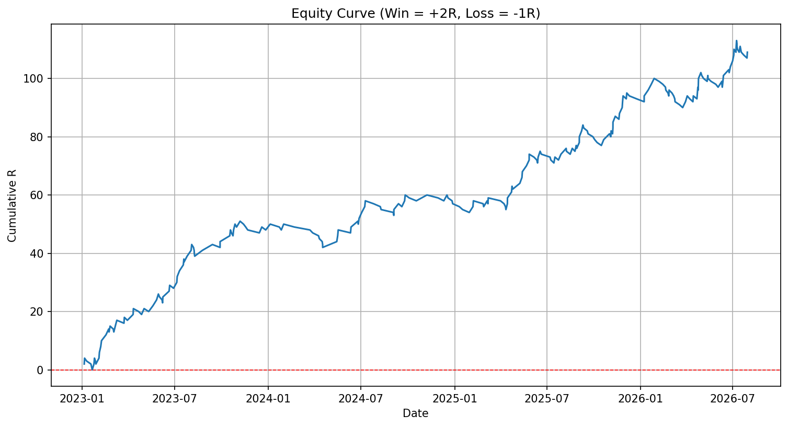
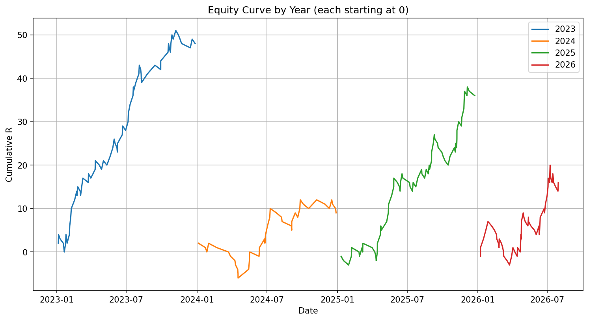

# XAUUSD Trading Strategy Analysis

A Python data analysis project evaluating the performance of a discretionary
XAUUSD (Gold) trading strategy, based on 248 real trades logged over
2023–2026.

## What this project does

- Cleans a raw trading journal export (handles German date formats,
  removes incomplete entries and rule-violation trades)
- Calculates core performance metrics: win rate, win rate by year, win rate
  by trade direction (long/short)
- Computes maximum drawdown
- Visualizes equity curve (overall and broken down by year)

## Key findings

| Metric | Value |
|---|---|
| Total trades analyzed | 248 |
| Overall win rate | 48.0% |
| Best year (win rate) | 2023 – 55.6% |
| Weakest year (win rate) | 2024 – 40.5% |
| Short vs. Long win rate | 52.1% vs. 42.5% |
| Max drawdown | -10.0R (March 2026) |

*Outcome model: win = +2R, loss = -1R, based on a fixed 1:2 risk/reward target.*

## Equity Curve



## Equity Curve by Year



## Project structure

```
.
├── analysis.py          # main analysis script
├── data/
│   └── trades.csv       # cleaned trade journal (exported from Notion)
├── requirements.txt
└── README.md
```

## Running it yourself

```bash
pip install -r requirements.txt
python analysis.py
```

## Notes on data source

Trade data was originally logged in Notion during live and demo trading,
then exported to CSV. Rows without a definitive win/loss outcome (open
trades, or trades flagged as rule violations) were excluded from the
analysis to avoid skewing performance metrics.

## Possible next steps

- Backtest the strategy's entry rules programmatically against historical
  price data (rather than relying on manually logged outcomes)
- Investigate the 2024 performance dip (rule violations vs. market
  conditions)
- Compare performance across trading sessions (Asia / London / New York)
